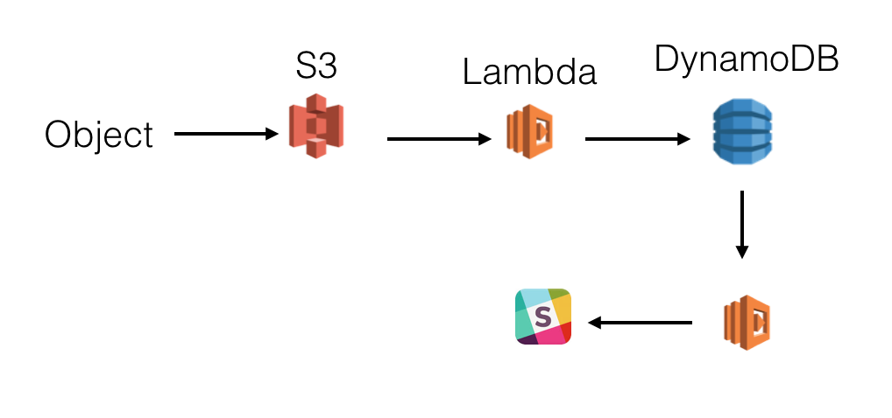

# Serverless-workshop

The intention is to process orders arriving as json-files, storing 
the orders in DynamoDB and sending notification via Slack or email about
incoming orders.

## Process incoming orders with Lambda

* Make a lambda-function triggered by file upload to S3
 * Order-file: [Example order file](files/order.json)
* Add order to DynamoDB-table
  
Hint: 
Lambda have blueprints for gettings started fast, start with "s3-get-object" and see that you get an event when a file is dropped in S3. Continue to add to database after that. 

Make a table in DynamoDB with a partition key and a sort key (exaple customerNumber+timestamp)

Use AWS Documentation: 
https://docs.aws.amazon.com/amazondynamodb/latest/developerguide/GettingStarted.NodeJs.03.html

[Lambda stage 1 - logging event](files/lambda1-index.js)

[Lambda stage 2 - writing to DynamoDB](files/lambda2-index.js)

## List orders from database

* Make a lambda to list all orders from DynamoDB
* Access lambda from API-gateway

Hint:
Use Lambda-blueprint "microservice-http-endpoint" and set up everything there

Use API-gateway console to test integration

[Lambda - reading from DynamoDB](files/lambda3-index.js)

## Process all orders, write to Slack
The intention here is to process the event-stream from DynamoDB and send all orders to Slack.
(You will need a slack-team-account and slack API-key)
* Enable DynemoDB-stream
* Send order or only comments to Slack. Remember to keep the Slack-key secret!

Hint:
Use Lambda-blue-print "cloudwatch-alarm-to-slack"
Let lambda be triggered by DynamoDB  

[Lambda - writing to Slack](files/lambda4-index.js)

## Send orders via email
(To be elaborated)

## Make web-frontend to enter orders
* Make a static website in S3 with an HTML-form to submit orders
  * submit as files to S3 (would need to be secured with Cognito to avoid uploading other ifles to S3)
  * submit as POST to Lambda via API-gateway (open or secured with Cognito)
